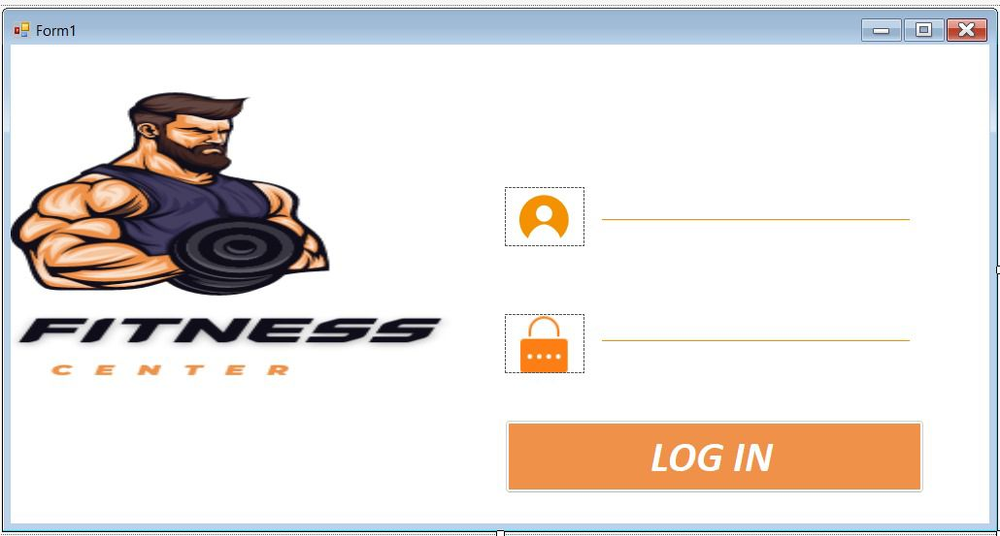
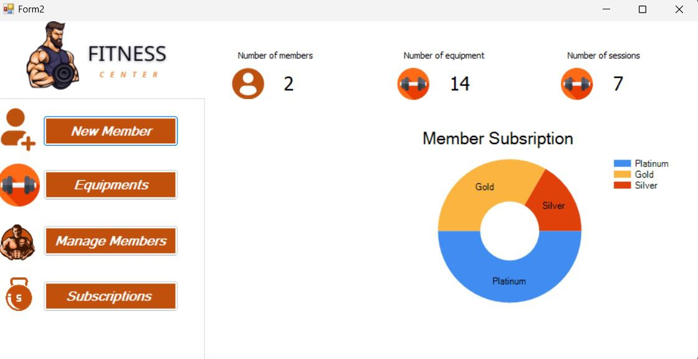

# Gym Management System

A comprehensive Windows Forms application for managing gym operations, including member registrations, subscriptions, sessions, equipment, and staff.

## Overview

The Gym Management System is designed to streamline the day-to-day operations of fitness centers and gyms. It provides a user-friendly interface for managing various aspects of gym management, from member registrations to equipment tracking.

## Features

### Member Management
- Register new members
- View and update member profiles
- Track membership status and history
- Manage member subscriptions

### Subscription Management
- Create and manage different subscription plans
- Track subscription renewals and payments
- Generate subscription reports

### Session Management
- Create and schedule fitness sessions
- Assign coaches to sessions
- Track session attendance
- Manage session capacity

### Equipment Management
- Track gym equipment inventory
- Monitor equipment maintenance
- Receive notifications for equipment issues
- Generate equipment reports

### Staff Management
- Manage coaches and receptionists
- Track employee information
- Assign roles and responsibilities

### Dashboard
- View key metrics and statistics
- Monitor gym performance
- Access quick links to common functions

### Authentication
- Secure login system
- Role-based access control
- Credential management

## Technical Details

### Technology Stack
- **Framework**: .NET Framework
- **UI**: Windows Forms
- **Database**: SQL Server
- **Language**: C#

### Project Structure
- **Controllers**: Business logic for different modules

- **Models**: Data models representing business entities

- **Views**: User interface forms organized by functionality
  ## Screenshots

### Login and Authentication

*Secure login interface 

### Dashboard

*Main dashboard showing key metrics and quick access to all system functions*
## Installation Requirements

- .NET Framework 4.7.2
- SQL Server Express
- Visual Studio 2017 or later (for development)
