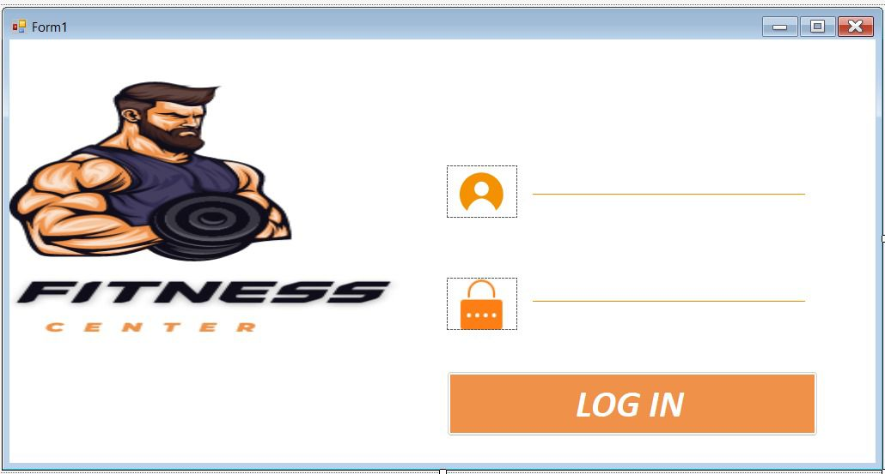
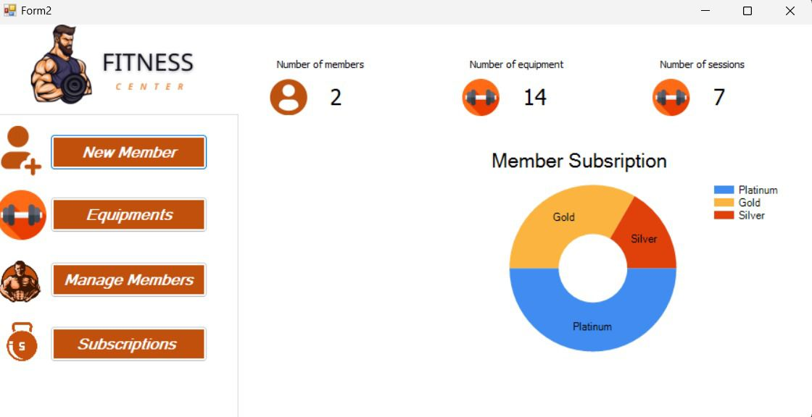

# Gym Management System

A Windows Forms application for managing gym operations, including members, subscriptions, sessions, equipment, and staff.

## Features

### Member Management

* Register and manage members
* Track membership status and history
* Manage subscriptions

### Subscription Management

* Create and manage subscription plans
* Track renewals and payments
* Generate reports

### Session Management

* Schedule fitness sessions
* Assign coaches
* Track attendance and capacity

### Equipment Management

* Track equipment inventory
* Monitor equipment maintenance
* Receive notifications for equipment issues

### Staff Management

* Manage coaches and receptionists
* Track employee information
* Assign roles and responsibilities

### Dashboard

* View key metrics and statistics
* Monitor gym performance
* Access quick links

### Authentication

* Secure login system
* Role-based access control

## Technology Stack

* **Language:** C#
* **Framework:** .NET Framework 4.7.2
* **UI:** Windows Forms
* **Database:** SQL Server

## Design Patterns

* **Observer Pattern** — Used to notify relevant components when important changes occur, such as equipment issues.
* **Factory Pattern** — Used to create objects based on their required type while keeping object creation separate from the main business logic.

## Project Structure

```text
WindowsFormsApp1/
├── Controllers/    # Business logic
├── Models/         # Data models
├── Views/          # Windows Forms UI
└── Images/         # Application images
```

## Screenshots

### Login



### Dashboard



## Requirements

* .NET Framework 4.7.2
* SQL Server Express
* Visual Studio 2017 or later
